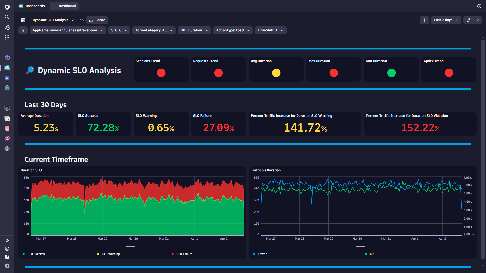

# Dynamic SLO Analysis Dashboard
This dashboard uses Causal AI to determine the relationship between Traffic and SLOs. The dashboard builds a model for your SLO and then predicts at what traffic volume your SLO will warn/fail on average. Leverage the variable dropdown filters to dynamically define your SLO (i.e. Duration for Key Load Actions set to 6 seconds).

# Prerequisites

None.

# Target Audience

- Application Owner
- Line of Business
- Executive
- Developer

# Use Cases

- What happens to my SLOs when Traffic increases?
- Do I need to optimize my SLOs prior to a major Marketing Campaign?
- What traffic volume will cause my SLOs to slip into a Warning state on average?
- What traffic volume will cause my SLOs to slip into a Failure state on average?
- Can my SLOs remain Succesful with increased loads due to major events like Cyber Monday?
  
# Install Instructions

- Download [Dashboard JSON](https://github.com/TechShady/Dynatrace-Dashboards-Gen3/blob/main/Dynamic%20SLO%20Analysis.json)
- Launch the new Gen3 UI
- Select the Dashboard app
- In the upper righthand corner, select Upload and select your json file
- Refresh your dashboard list and launch your Dashboard

# User Guide

The SLO Analysis Dashboard is broken down into four sections.

The dashboard header section has six filters that you can apply to your Traffic Simulator Dashboard:
- AppName - List of applications currently monitored by Dynatrace. Select the application to filter the dashboard for any application. 
- SLO - The SLO in seconds for your KPI (i.e. Duration).
- ActionCategory - Filter for action type. Select All, Key, Entry or Exit.
- KPI - Filter for User Action KPI (i.e. Duration, Visually Complete, Speed Index, etc).
- ActionType - Filter for action type. Select Load, xHr.
- TimeShift - Value in days used by KPIs (Session Trend, Request Trend and Apdex Trend) to compare against. For example, a value of 7 will compare the KPI based on the current timeframe and compare that value to the same timeframe shifted by 7 days.
  

The top section is called the KPI banner. This section has the following KPIs:
- Session Trend - Session count for the current timeframe compared to the timeshifted timeframe. Green if trend has increased, otherwise it's red.
- Request Trend - Request count for the current timeframe compared to the timeshifted timeframe. Green if trend has increased, otherwise it's red.
- Average KPI - SLO average for the current timeframe based on the selected KPI. Colorization based on tile threshold settings.
- Max KPI - SLO max for the current timeframe based on the selected KPI. Colorization based on tile threshold settings.
- Min KPI - SLO min for the current timeframe based on the selected KPI. Colorization based on tile threshold settings.
- Apdex Trend - Apdex for the current timeframe compared to the timeshifted timeframe. Green if trend has increased, otherwise it's red. Application Performance Index is a standard developed by an alliance of companies for measuring the performance of applications. A perfect Apdex score is 1.

The middle section displays metrics for the last 30 days for Average KPI, SLO Success, SLO Warning and SLO Failure. The two right most tiles display the predicted traffic percent increase that will cause your SLO to be in Warning and Failure state. 

The bottom section shows your SLO over the current timeframe in the left tile and Traffix vs KPI over the current timefrsame in the right tile.
