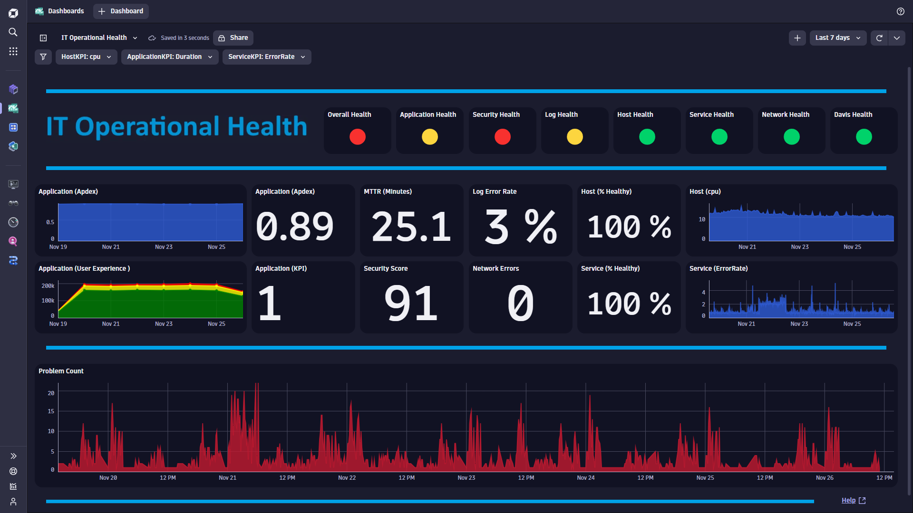

# Operational Health Dashboard
This dashboard provides a health overview for an Applications, Security, Logs, Hosts, Services, Network and Problems.

# Prerequisites

None.

# Target Audience

- Executive
- Line of Business
- Application Owner
- SRE

# Use Cases

- What is the overall health of Ecosystem?
- Is MTTR currently acceptable?
- Is my Network healthy and free of errors?
- Is my application easy to use and are my users achieving good experiences?
- Are my customers satisfied with their digital experiences?
- Do I have any Security exposures that need attention?
- Do I have any critical log messages that need attention?
- How are my Hosts performing?
- How are my Services performing?
- Are any of my Services failing and need attention?

# Install Instructions

- Download [Dashboard JSON](https://github.com/TechShady/Dynatrace-Dashboards-Gen3/blob/main/Operational%20Health.json)
- Launch the new Gen3 UI
- Select the Dashboard app
- In the upper righthand corner, select Upload and select your json file
- Refresh your dashboard list and launch your Dashboard

# User Guide

The Operational Health Dashboard is broken down into four sections.

The dashboard header section has three filters that you can apply to your Operational Health Dashboard:
- HostKPI - Select cpu or memory. This will change the Host graph in the middle section to reflect your KPI.
- ApplicationKPI - Select any KPI (i.e. Duration, SpeedIndex, etc). This will change the the Application single value tile to reflect your KPI.
- ServiceKPI - Select ErrorRate or ResponseTime. This will change the Host graph in the middle section to reflect your KPI.

The top section is called the Health banner. This section has the following Health Indicators:
- Overall Health: If all Health indicators are green, Overall Health will be green. If any Health Indicator is red, Overall Health will be red. And just like in soccer, two yellow Health Indicators equals red.
- Application Health: Calculated using Apdex. Apdex >.92 is green. .92< Apdex >.80 is yellow. Apdex <.80 is red.
- Security Health: Security Score is calculated by analyzing security threat exposure. Security Score < 70 is green. 70> Security Score <89 is yellow. Security Score >89 is red.
- Log Health: Percentage of log error messages. Error Rate <3 is green. 3> Error Rate <10 is yellow. Error Rate >10 is red.
- Host Health: Host Health status as determined by Davis. Healthy is green. Unhealthy is red.
- Service Health: Service Health status as determined by Davis. Healthy is green. Unhealthy is red.
- Network Health: Based on Packet Error count. If Packet Error = 0, Network Health is green. If Packet Error > 0, Network Health is red.
- Davis Health: MTTR is calculated based on the average time a Problem is open. MTTR<30 minutes is green. 30> MTTR <60 is yellow. MTTR >60 is red.

The middle section displays the following Graphs and Metrics: 
- Application Apdex - Application Performance Index is a standard developed by an alliance of companies for measuring the performance of applications. A perfect Apdex score is 1.
- Application User Experience and ApplicationKPI - User Experience is rated as Satisfied, Tolerated or Frustrated.
- MTTR - MTTR is calculated based on the average time a Problem is open.
- Log Error Rate - Percentage of log error messages.
- Security Score - Security Score is calculated by analyzing security threat exposure.
- Network Errors - Packet Error count.
- Host KPI and Health - Host Health status as determined by Davis.
- Service KPI and HEalth - Service Health status as determined by Davis.
 

The bottom section charts Problem count over the current timeframe.
