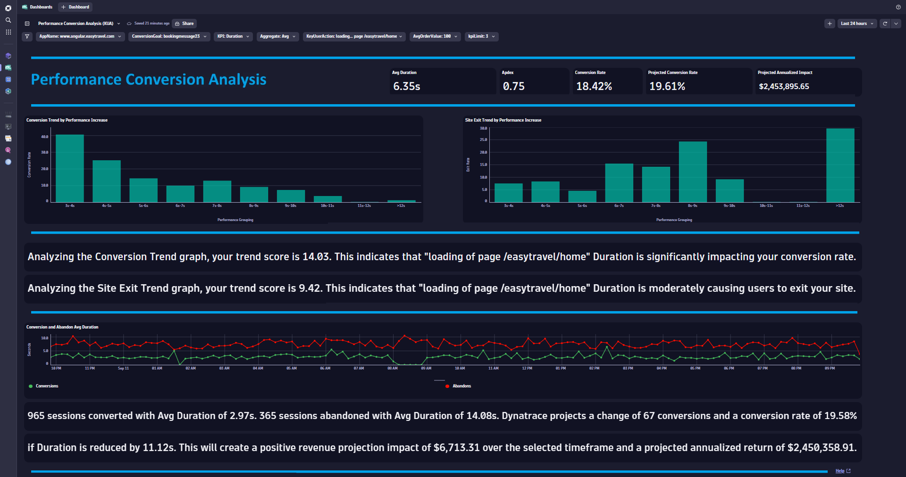

# Performance Conversion Analysis (KUA) Dashboard
This dashboard provides a performance conversion analysis for your applications and tells you if the performance for a certain User Action impacts your conversion rate.

# Prerequisites

Required: [Create a conversion goal](https://www.dynatrace.com/support/help/platform-modules/digital-experience/web-applications/analyze-and-use/define-conversion-goals) for a user action that indicates a completed business transaction (i.e. Order Confirmation Page).

Required: [Create a session property](https://www.dynatrace.com/support/help/platform-modules/digital-experience/custom-applications/additional-configuration/define-custom-action-and-session-properties) from your conversion page (i.e. String: OrderCompleted).

# Target Audience

- Application Owner
- Line of Business
- Executive
- Web Developer

# Use Cases

- What is the APDEX for my Key User Action?
- Is my user traffic increasing?
- Does the performance of my Key User Action impacting my Conversion Rate?
- Are users that interract with my Key User Action converting efficiently?
- What is the optimal performance for my Key User Action with respect to conversions?

# Install Instructions

- Download [Dashboard JSON](https://github.com/TechShady/Dynatrace-Dashboards-Gen3/blob/main/Performance%20Conversion%20Analysis%20(KUA).json)
- Launch the new Gen3 UI
- Select the Dashboard app
- In the upper righthand corner, select Upload and select your json file
- Refresh your dashboard list and launch your Dashboard
- Modify the ConversionGoal variable filter and replace with your conversion session property

# User Guide

The Performance Conversion Analysis Dashboard is broken down into four sections.

The dashboard header section has five filters that you can apply to your Performance Conversion Analysis Dashboard:
- AppName - List of applications currently monitored by Dynatrace. Select the application to filter the dashboard for any application.
- KPI - List of KPIs used in analysis (i.e. Duration, Visually Complete Time).
- Aggregate - List of aggregations used in analysis (i.e. Avg, Median).
- KeyUserAction - A list of key user actions that you can analyze.
- MilestoneGoal - List of conversion goals. Select the conversion goal that indicates the start of a business transaction.
- ConversionGoal - List of conversion goals. Select the conversion goal that indicates the completion of a business transaction.

The top section is called the KPI banner. This section has the following KPIs:
- Performance Metric: Configured based on the KPI and Aggregate selected (i.e. Avg Duration).
- Sessions: Total number of user sessions that executed the Key User Action.
- Efficiency Rate: Rate of sessions that converted with good user experience. A perfect efficiency rate is 100.
- Deficiency Rate: Rate of sessions that abandoned with poor user experience. A perfect deficiency rate is 0.
- Conversion Rate: Rate of sessions that converted.
- Apdex: Application Performance Index is a standard developed by an alliance of companies for measuring the performance of applications. A perfect Apdex score is 1.

Each KPI cell displays the current value for the last 24 hours. Each KPI is compared to a seven-day time shift over the past 24 hours and will display, in parentheses, the KPI difference and trend direction.

The middle section displays the conversion analysis for your Key User Action. Each column filters the data based on the performance range of the Key User Action (i.e. <2s, 2s - 3s). The rows show the conversion count, abandon count and the conversion rate for your Key User Action. 

The bottom section charts the conversion rate over the performance ranges. The bottom right corner has two links. The ChatGPT link will detail how to tune the KPI with expert recommendations and the Help link provides dashboard help.
