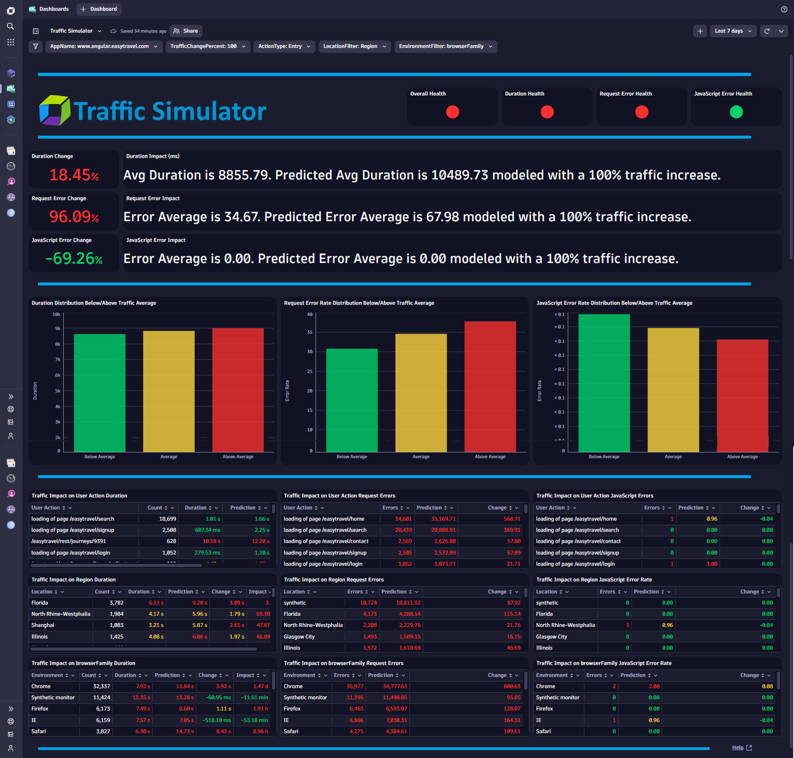
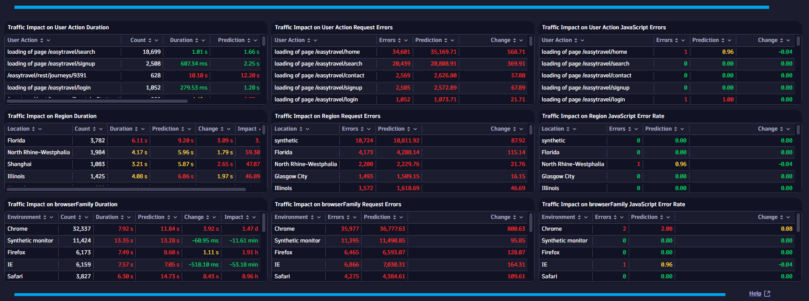

# Traffic Simulator Dashboard
This dashboard uses Causal AI to determine the relationship between Traffic and KPIs (User Action Duration, Request Errors and JavaScript Errors). The dashboard builds a model for each KPI and then enable Predictive Analytics based on Traffic changes.

# Prerequisites

None.

# Target Audience

- Application Owner
- Line of Business
- Executive
- Developer

# Use Cases

- TDB
  
# Install Instructions

- Download [Dashboard JSON](https://github.com/TechShady/Dynatrace-Dashboards-Gen3/blob/main/Traffic%20Simulator.json)
- Launch the new Gen3 UI
- Select the Dashboard app
- In the upper righthand corner, select Upload and select your json file
- Refresh your dashboard list and launch your Dashboard

# User Guide

The Traffic Simulator Dashboard is broken down into five sections.

The dashboard header section has five filters that you can apply to your Traffic Simulator Dashboard:
- AppName - List of applications currently monitored by Dynatrace. Select the application to filter the dashboard for any application. 
- TrafficChangePercent - Select the percent increase in Traffic that you want to use for simulation.
- ActionType - Filter for action type. Select All, Key, Entry or Exit.
- LocationFilter - Filter for GEO. Select Country, Continent, Region or City. This filter applies to the table detail breakdown at the bottom of the dashboard.
- EnvironmentFilter - Filter for Browser Family, Browser Major Version, ISP, OS Family or OS Version.  This filter applies to the table detail breakdown at the bottom of the dashboard.
  

The top section is called the KPI banner. This section has the following KPIs:

- Overall Health - Overall simulation health. If any of the KPI Health Indicators are red, Overall Health will be red. If two KPI Health Indicators are yellow, Overall Health will be red. If one KPI Health Indicators is yellow and the other two are green, Overall Health will be yellow. Otherwise, Overall Health is green.
- Duration Health - If Duration percent increase is more than 3%, Duration Health Indicatior is red. If Duration percent is greater than 0%, but less than 3%, Duration Health Indicator is yellow. Otherwise, Duration Health Indicator is green.
- Request Error Health - If Request Error percent increase is more than 3%, Request Error Health Indicatior is red. If Request Error percent is greater than 0%, but less than 3%, Request Error Health Indicator is yellow. Otherwise, Request Error Health Indicator is green.
- JavaScript Error Health - If JavaScript Error percent increase is more than 3%, JavaScript Error Health Indicatior is red. If JavaScript Error percent is greater than 0%, but less than 3%, JavaScript Error Health Indicator is yellow. JavaScript Error, Duration Health Indicator is green.

The upper middle section displays the percent change and detaiuled description for each KPI. 

The lower middle section plots the KPI distribution below/above Traffic average.

The bottom section details each KPI by User Action, GEO (Filter based) and Environment (filter based).
